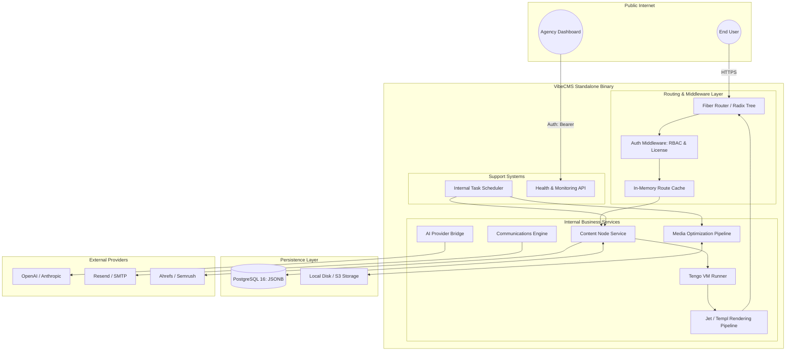

# VibeCMS System Architecture

## About This Document

**Purpose:** Component diagram and data flow defining how the system is structured. The authoritative reference for system boundaries and communication patterns.

**How AI tools should use this:** Reference this document before designing new components; ensure new code fits within existing component boundaries.

**Consistency requirements:** Components must use only technologies from tech-stack.md; data stores must match tables in database-schema.md; service boundaries must align with endpoints in api-spec.md.

VibeCMS is architected as a high-performance, single-binary application designed to be deployed once per website. This decentralized deployment model eliminates cross-tenant "noisy neighbor" effects and simplifies scaling for agencies. The system balances the raw speed of compiled Go with the flexibility of interpreted Tengo scripting for business logic. By utilizing a "Zero-Allocation" approach in the rendering pipeline and an in-memory routing trie, the architecture ensures that most requests are served within the target sub-50ms TTFB window.

---

### Component Diagram

The following diagram illustrates the internal structure of the VibeCMS binary and its interactions with external persistence layers and third-party APIs.

---

### Data Flow

#### 1. Public Content Delivery (The "Vibe Loop")
This is the mission-critical path representing the core product value: sub-50ms TTFB.
1.  **Request Entry:** User requests a URL (e.g., `/en/about-us`).
2.  **Route Resolution:** The Router queries the **In-Memory CacheMgr** (Zero DB hit for 404 detection).
3.  **Data Fetch:** **ContentSvc** retrieves the `blocks_data` JSONB and `node_metadata` from **Postgres** using a single indexed query.
4.  **Extension Hook:** If a `before_render.tgo` script exists, **ScriptEx** (Tengo) runs within a 10ms timeout.
5.  **Rendering:** The **Jet Engine** iterates through the JSON blocks, pulling pre-compiled `.jet` fragments from RAM and assembling the final HTML.
6.  **Response:** The HTML stream is flushed to the user via Fiber.

#### 2. AI-Native Content Generation
1.  **Trigger:** Admin selects "Suggest SEO" in the UI (HTMX request).
2.  **Context Assembly:** **ContentSvc** extracts raw text from the `blocks_data` JSONB.
3.  **LLM Bridge:** **AISvc** sends the structured data + current JSON schema to **OpenAI/Anthropic**.
4.  **Transformation:** The AI returns structured JSON matching the Vibe-Field schema.
5.  **Persistence:** The Admin reviews and "Saves," updating the `seo_meta` column in **Postgres**.

#### 3. Media Upload & Optimization
1.  **Upload:** Admin posts an image via the Media Manager (Multipart).
2.  **Storage:** The original file is written to the **Storage** provider (e.g., S3).
3.  **Async Task:** **Cron** triggers a background Go routine in the **MediaPipe**.
4.  **Optimization:** The image is converted to WebP and multiple breakpoints are generated using `libvips`.
5.  **DB Update:** The `media_assets` table is updated with the new WebP paths and dimensions.

---

### Communication Patterns

| Pattern | Source/Target | Protocol | Reason |
| :--- | :--- | :--- | :--- |
| **Sync (REST)** | Frontend Browser -> Fiber | HTTPS | Real-time Admin UI interactions (HTMX). |
| **Sync (In-Proc)** | Fiber -> Tengo VM | Function Call | Script execution must block the render pipeline to inject data. |
| **Async (Internal)** | ContentSvc -> MailSvc | Go Channels | Sending emails must not delay the 50ms HTTP response. |
| **Async (Polled)** | Agency Dashboard -> HealthSvc | HTTPS | Centralized monitoring of hundreds of independent instances. |
| **Sync (TCP)** | Fiber -> PostgreSQL | SQL (Binary) | Standard relational persistence via GORM. |

---

### Scalability and Reliability Considerations

*   **Decoupled Instances:** By choosing a 1-site-per-binary model, a failure in one customer's environment (e.g., an infinite Tengo loop) cannot affect other sites managed by the agency.
*   **Zero-Downtime Migration:** VibeCMS uses a state-version check on boot. If the binary is updated, it runs idempotent migrations inside a single SQL transaction. If the transaction fails, the app halts before serving corrupted data.
*   **In-Memory Hot-Swapping:** Large datasets like Content Route Maps and Sitemaps are kept in memory and swapped atomically (using `atomic.Value`), ensuring reading requests never block writing updates.
*   **Circuit Breakers on External APIs:** The **AISvc** and **MailSvc** implement exponential backoff and timeouts to ensure that a service outage at Resend or OpenAI does not hang VibeCMS worker pools.

---

### Error Handling

| Component | Failure Scenario | Detection | Recovery / Outcome |
| :--- | :--- | :--- | :--- |
| **Tengo VM** | Script runtime error or infinite loop. | Execution Timeout (10ms context). | **Soft-Fail:** Script is killed, error logged to `system_logs`, render continues without script data. |
| **Jet Engine** | Request for missing block template. | Filesystem/Cache miss. | **Non-fatal:** Renders an HTML comment `<!-- Missing Template -->`, keeps the rest of the page intact. |
| **Postgres** | Connection loss / Pool exhaustion. | DB Health Check / GORM error. | **Fatal Handle:** Redirects to a static `503.html` if fallback cache is missing; reports `down` status to Monitoring API. |
| **License Layer** | Ed25519 signature mismatch. | Background Cron Verification. | **Non-blocking:** Logs warning to Agency Dashboard; disables Tengo and AI features; site remains live. |

---

### Security Boundaries

#### 1. Network Perimeter
*   **Public Access:** Only the Fiber HTTP port (Default 8080/443) is exposed.
*   **Admin UI:** Protected by session-based RBAC and CSRF tokens.
*   **Monitoring API:** Publicly visible but requires a **Unique Static Bearer Token** per instance and enforces strict Rate Limiting.

#### 2. Scripting Sandbox (Tengo)
*   **Isolation:** Tengo scripts have **no access** to the host filesystem (`os` and `io` libraries are stripped).
*   **Scope:** Scripts only see a provided "Context Map" containing JSON data and authorized helper methods (e.g., `mail.send`).

#### 3. Data Protection
*   **Encryption in Transit:** All communication with external APIs (OpenAI, Resend, S3) occurs over TLS 1.3.
*   **Encryption at Rest:** Sensitive credentials (SMTP passwords, S3 Secrets) should be managed via Environment Variables; Database backups are AES-256 encrypted before upload to S3.
*   **License Security:** Ed25519 signatures prevent domain-spoofing; the CMS validates its local license key against the active `Host` header.