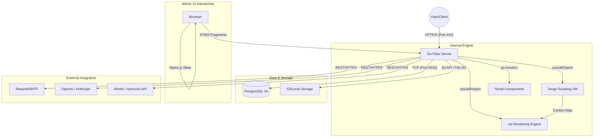

# VibeCMS Technology Stack

## About This Document

**Purpose:** Justified technology selections for this specific project. Establishes the implementation boundaries all other technical documents must respect.

**How AI tools should use this:** Use only the technologies listed here when generating code or configurations; do not introduce unlisted libraries.

**Consistency requirements:** Technology choices must be compatible with the architecture in architecture.md; directory conventions must match folder-structure.md.

VibeCMS is a high-performance, single-binary Content Management System built for speed and adaptability. To achieve a sub-50ms Time to First Byte (TTFB) while remaining "AI-native," we have selected a stack that prioritizes compiled performance and low-overhead communication. The backend is powered by Go, utilizing a dual-templating approach for maximum efficiency. Extension logic is handled via an embedded scripting engine rather than server recompilation. The administrative interface avoids the weight of modern JavaScript frameworks in favor of server-driven interactivity, ensuring the system remains lightweight for both the server and the browser.

---

### Core Layers

#### Backend (Stated)
- **Go 1.22.x+**: Primary language for the core engine.
- **Fiber 2.52.x (or Echo 4.12.x)**: High-performance web framework for routing and middleware.
- **GORM 1.25.x**: ORM for PostgreSQL interactions with JSONB support.
- **Tengo 2.16.x**: The embedded scripting language for "zero-rebuild" logic.

#### Database (Stated)
- **PostgreSQL 16.x**: Main relational store, specifically leveraging `JSONB` for content blocks and `GIN` indexes for performance.

#### Templating (Stated)
- **Jet 6.x**: Primary high-performance, Twig-like engine for theme rendering.
- **Templ 0.2.x**: Type-safe Go components for complex, logic-heavy Admin UI elements.

#### Frontend / Admin UI (Stated)
- **HTMX 1.9.x**: Handles AJAX, Server-Sent Events, and WebSockets via HTML attributes.
- **Alpine.js 3.13.x**: Provides localized client-side reactivity and state management.
- **Tailwind CSS 3.4.x (Architected)**: Recommended utility-first CSS for building a custom, lightweight Admin UI without heavy component libraries.

#### Infrastructure & Storage (Stated)
- **S3-Compatible Storage**: Support for AWS S3, DigitalOcean Spaces, or Cloudflare R2 via `aws-sdk-go-v2`.
- **Local Filesystem**: Fallback storage for single-instance deployments.

#### Integrations (Stated / Architected)
- **Resend Go SDK 1.7.x**: Native integration for high-deliverability email.
- **OpenAI / Anthropic API**: LLM providers for AI-native content/SEO features.
- **Ed25519 (Standard Library)**: Used for cryptographic license verification.

---

### Integration Map

---

### Decision Log

| Technology Layer | Choice | Alternatives Considered | Rationale |
|-----------------|--------|------------------------|-----------|
| **Primary Language** | Go 1.22.x | PHP 8.3, Node.js | Required for sub-50ms TTFB and single-binary "agency-friendly" distribution. |
| **Scripting Engine** | Tengo 2.16.x | Lua, WASM | Tengo's Go-native syntax and strict sandboxing balance performance and developer ease-of-use. |
| **Admin Interactivity**| HTMX + Alpine.js | React, Vue | Native server-rendered fragments align with Go's speed; avoids high-JS overhead/SEO friction. |
| **Web Framework** | Fiber 2.52.x | Standard `net/http` | Fiber’s Zero-allocation focus is critical for the sub-50ms TTFB threshold. |
| **Content Storage** | Postgres JSONB | SQLite, MongoDB | JSONB offers the flexibility of NoSQL with the ACID compliance and relational indexing of SQL. |
| **Theming Engine** | Jet 6.x | Go `html/template` | Jet is significantly faster and offers a syntax designers (used to Twig/Liquid) prefer. |
| **CSS Framework** | Tailwind 3.4.x | Bootstrap, Plain CSS | **Architected:** Facilitates rapid UI development for the block-editor while keeping CSS bundles small. |
| **Mail Delivery** | Resend Go SDK | Mailgun, SendGrid | **Architected:** Matches the modern "Agency-first" aesthetic with superior Go SDK support and developer experience. |
| **License Security** | Ed25519 | RSA, JWT | Ed25519 provides compact, high-performance offline verification for domain-based licensing. |
| **Task Scheduling** | Go Channels/Ticker | Redis-backed workers | Avoids external dependencies (Redis), keeping the single-binary deployment promise. |