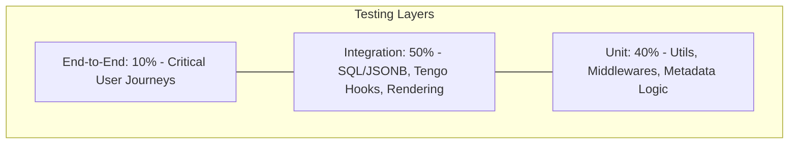

# VibeCMS Testing Strategy

## About This Document

**Purpose:** Comprehensive testing strategy defining what to test, how to test it, and what coverage targets must be met before shipping.

**How AI tools should use this:** Use this document when generating test files; follow the testing patterns, naming conventions, and coverage requirements defined here.

**Consistency requirements:** Test scope must cover every endpoint in api-spec.md, every requirement in product-requirements.md, and every component in architecture.md; test database fixtures must use tables from database-schema.md.

VibeCMS is built for professional agencies where site speed and reliability are non-negotiable. Because our primary success metric is a sub-50ms Time to First Byte (TTFB), our tests do not just verify if the code works, but ensure that new features do not introduce "performance bloat." This strategy balances the need for high-speed unit tests with deep integration tests for our complex JSONB-based content storage and embedded Tengo scripting engine. Every deployment is a single binary, so our testing must guarantee that this binary is "battle-ready" for hundreds of independent agency environments.

---

### Testing Pyramid

VibeCMS utilizes a pyramid heavily weighted toward **Integration Tests**. While unit tests handle logic, the core value of VibeCMS lies in the interaction between the Go backend, PostgreSQL JSONB queries, and the Tengo VM hooks. We prioritize integration tests to ensure that the "Vibe Loop" (Data -> Script -> Template) remains intact.



*   **Unit Tests:** Fast, isolated tests for independent logic.
*   **Integration Tests:** Real PostgreSQL and Tengo VM execution. Validates the performance of JSONB lookups.
*   **E2E Tests:** Validates the Admin UI (HTMX/Alpine) and the final rendered HTML output.

---

### Unit Tests

Unit tests focus on the high-performance building blocks of the VibeCMS binary.

*   **Routing & Middleware:** Test the Radix tree for localized route resolution.
    *   *Example:* Assert that a request to `/sk/o-nas` correctly resolves the `language_code` to "sk" and the `slug` to "o-nas" in <1ms.
*   **SEO & Metadata Logic:** Test the generation of Schema.org JSON-LD from raw block data.
    *   *Example:* Assert that an `faq_block` in the JSON array produces a valid `FAQPage` JSON-LD string.
*   **Licensing Engine:** Offline verification of Ed25519 signatures.
    *   *Example:* Assert that a valid key for `agency.test` fails when the Host header is `client.test`.
*   **Mocking Policy:** Mock external APIs (OpenAI, Resend, S3). Do **not** mock the internal database for unit tests involving GORM models; use `go-sqlmock` or a transient SQLite memory DB if applicable, though Integration tests are preferred for DB logic.
*   **Coverage Target:** 80%.

---

### Integration Tests

This is the most critical layer for VibeCMS. We use real dependencies to verify the "Zero-Rebuild" architecture.

*   **Component Scope:**
    *   **PostgreSQL & JSONB:** Test complex GIN-indexed queries for block content.
    *   **Tengo VM Hooks:** Run real `.tgo` scripts against a mock `vibe` context.
    *   **Jet/Templ Pipeline:** Render full pages and assert the presence of specific HTML fragments.
*   **Environment:** Tests run against a Dockerized PostgreSQL 16 instance.
*   **Seeding Strategy:**
    *   Each test suite uses `db.Transaction` to rollback changes.
    *   Fixtures are loaded from `test/fixtures/*.json` representing the `content_nodes` table.
*   **Tengo Testing:** Specific tests for the `10ms` execution timeout.
    *   *Example Case:* Load a script with an infinite loop; assert the Go backend cancels execution and returns a "soft-fail" response within the time limit.

---

### End-to-End Tests

E2E tests use **Playwright** to simulate agency workflows in the Admin UI and verify public-facing TTFB headers.

1.  **Block Content Creation:** Log in as Admin -> Create "Page" -> Add "Hero Block" -> Save. *Assertion:* Row exists in `content_nodes` with correct JSONB.
2.  **Tengo Extension Workflow:** Upload a `.tgo` script via Admin -> Trigger hook (e.g., submit form) -> Verify script side-effect (e.g., mail log created).
3.  **Multilingual Routing:** Create English page -> Translate to Slovak -> Visit `/sk/slug`. *Assertion:* Correct Jet template renders with Slovak content.
4.  **Media Optimization:** Upload 5MB PNG -> Wait for Cron -> Inspect `media_assets`. *Assertion:* Three WebP variants exist on storage.
5.  **Agency Monitoring API:** Call `/api/v1/monitor/stats` with Bearer token. *Assertion:* Returns `200 OK` with valid JSON telemetry data.
6.  **AI SEO Suggestion:** Click "Suggest" in SEO panel -> Wait for AI response -> Click "Apply". *Assertion:* `meta_settings` JSONB updated with new title.

---

### Test Data Strategy

*   **Factories:** Use factory functions (e.g., `NewTestNode()`) to generate random but valid `content_nodes` to avoid ID collisions.
*   **Snapshots:** For rendering tests, use **Snapshot Testing**. Store the "golden" HTML output in `test/snapshots` and compare against new renders to detect regressions in the Jet engine.
*   **Cleanup:** The `test_main.go` file facilitates a global `TRUNCATE` of all tables in the `database-schema.md` before the suite runs.
*   **S3 Mocking:** Use **MinIO** in CI to simulate S3-compatible storage for the Media Manager.

---

### Coverage Requirements

| Layer | Minimum Coverage | Measurement Tool |
|-------|-----------------|-----------------|
| **Unit** | 80% Line Coverage | `go test -cover` |
| **Integration** | 100% of SQL Queries | `sql-coverage` (manual check) |
| **Tengo Scripts**| Any "Core" Hook | Manual Execution Test |
| **E2E** | All P0 User Journeys | Playwright Dashboard |
| **Performance** | < 15ms Render Time | `go test -bench` |

---

### Running Tests

**Local Environment:**
```bash
# Run all unit and integration tests
docker-compose up -d postgres minio
go test ./...

# Run a specific test file
go test ./internal/content/node_service_test.go

# Run with coverage report
go test -coverprofile=coverage.out ./... && go tool cover -html=coverage.out
```

**CI/CD (GitHub Actions):**
1.  **Stage 1: Lint.** `golangci-lint run`.
2.  **Stage 2: Unit/Integration.** Spins up Postgres 16 services. Runs `go test`.
3.  **Stage 3: E2E.** Builds the VibeCMS binary, runs `playwright test`.
4.  **Stage 4: Benchmarking.** Runs `go test -bench`. If TTFB mean exceeds 50ms, the build fails.