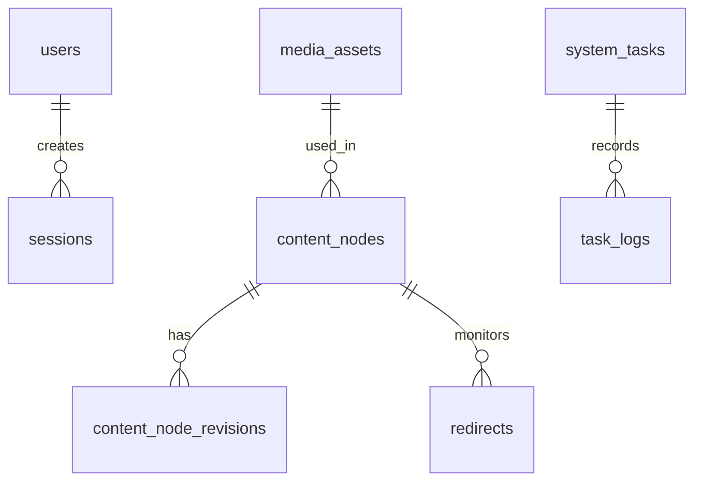

# VibeCMS Database Schema

## About This Document

**Purpose:** Authoritative table definitions and relationships. Every database interaction in the codebase must conform to this schema.

**How AI tools should use this:** Reference table names, column names, and types from this document when writing queries or ORM models.

**Consistency requirements:** Data stores must match components defined in architecture.md; request and response fields in api-spec.md must trace to columns in these tables.

This document describes the structure of the VibeCMS database. The schema is designed for high-performance content delivery, utilizing PostgreSQL's JSONB capabilities for flexible block-based data while maintaining strict relational integrity for system-critical tasks like mail logging and background scheduling. It supports the "one deployment per site" architecture required by agency users.

---

## Entity Relationship Diagram



---

## Table Definitions

### users
Stores administrative accounts for the CMS.
```sql
CREATE TABLE users (
    id SERIAL PRIMARY KEY,
    email VARCHAR(255) NOT NULL UNIQUE,
    password_hash VARCHAR(255) NOT NULL,
    role VARCHAR(50) NOT NULL DEFAULT 'editor', -- admin, editor, agency-manager
    full_name VARCHAR(100),
    last_login_at TIMESTAMPTZ,
    created_at TIMESTAMPTZ NOT NULL DEFAULT CURRENT_TIMESTAMP,
    updated_at TIMESTAMPTZ NOT NULL DEFAULT CURRENT_TIMESTAMP
);
```

### sessions
Manages active administrative sessions (referenced in Section 14.1.2).
```sql
CREATE TABLE sessions (
    id UUID PRIMARY KEY DEFAULT gen_random_uuid(),
    user_id INT NOT NULL REFERENCES users(id) ON DELETE CASCADE,
    token_hash VARCHAR(255) NOT NULL UNIQUE,
    ip_address VARCHAR(45),
    user_agent TEXT,
    expires_at TIMESTAMPTZ NOT NULL,
    created_at TIMESTAMPTZ NOT NULL DEFAULT CURRENT_TIMESTAMP
);
```

### content_nodes
The primary table for all routable entities (Pages, Posts, Custom Entities).
```sql
CREATE TABLE content_nodes (
    id SERIAL PRIMARY KEY,
    uuid UUID NOT NULL DEFAULT gen_random_uuid() UNIQUE,
    parent_id INT REFERENCES content_nodes(id) ON DELETE SET NULL,
    node_type VARCHAR(50) NOT NULL DEFAULT 'page',
    status VARCHAR(20) NOT NULL DEFAULT 'draft', -- draft, published, archived
    language_code VARCHAR(10) NOT NULL DEFAULT 'en',
    slug VARCHAR(255) NOT NULL,
    full_url TEXT NOT NULL UNIQUE, -- e.g., /en/blog/my-post
    title VARCHAR(255) NOT NULL,
    blocks_data JSONB NOT NULL DEFAULT '[]', -- Structured Vibe-Blocks
    seo_settings JSONB NOT NULL DEFAULT '{}', -- meta_title, meta_desc, noindex
    translation_group_id UUID, -- Links translations together
    version INT NOT NULL DEFAULT 1,
    published_at TIMESTAMPTZ,
    created_at TIMESTAMPTZ NOT NULL DEFAULT CURRENT_TIMESTAMP,
    updated_at TIMESTAMPTZ NOT NULL DEFAULT CURRENT_TIMESTAMP,
    deleted_at TIMESTAMPTZ -- Support for soft deletes
);
CREATE INDEX idx_nodes_status_lang ON content_nodes(status, language_code);
CREATE INDEX idx_nodes_blocks ON content_nodes USING GIN (blocks_data);
```

### content_node_revisions
Stores historical snapshots for "Point-in-Time" recovery (max 50 per node).
```sql
CREATE TABLE content_node_revisions (
    id BIGSERIAL PRIMARY KEY,
    node_id INT NOT NULL REFERENCES content_nodes(id) ON DELETE CASCADE,
    blocks_snapshot JSONB NOT NULL,
    seo_snapshot JSONB NOT NULL,
    created_by INT REFERENCES users(id),
    created_at TIMESTAMPTZ NOT NULL DEFAULT CURRENT_TIMESTAMP
);
```

### redirects
Manages SEO link equity for moved content (referenced in Section 7.7).
```sql
CREATE TABLE redirects (
    id SERIAL PRIMARY KEY,
    old_url TEXT NOT NULL UNIQUE,
    new_url TEXT NOT NULL,
    http_code INT NOT NULL DEFAULT 301, -- 301 or 302
    created_at TIMESTAMPTZ NOT NULL DEFAULT CURRENT_TIMESTAMP
);
```

### site_settings
Global configuration and external API keys (System Configuration).
```sql
CREATE TABLE site_settings (
    key VARCHAR(100) PRIMARY KEY,
    value TEXT,
    is_encrypted BOOLEAN DEFAULT false, -- For SMTP/AI/SEO API keys
    updated_at TIMESTAMPTZ NOT NULL DEFAULT CURRENT_TIMESTAMP
);
```

### media_assets
Tracks all uploaded files and WebP derivatives.
```sql
CREATE TABLE media_assets (
    id UUID PRIMARY KEY DEFAULT gen_random_uuid(),
    filename VARCHAR(255) NOT NULL,
    provider VARCHAR(20) NOT NULL DEFAULT 'local', -- local, s3, r2
    file_path TEXT NOT NULL,
    webp_path TEXT,
    mime_type VARCHAR(100),
    byte_size BIGINT,
    dimensions JSONB, -- {width: 1024, height: 768}
    alt_text TEXT,
    focal_point JSONB DEFAULT '{"x": 50, "y": 50}',
    created_at TIMESTAMPTZ NOT NULL DEFAULT CURRENT_TIMESTAMP
);
```

### mail_logs
Audit trail for all SMTP/Resend communications.
```sql
CREATE TABLE mail_logs (
    id UUID PRIMARY KEY DEFAULT gen_random_uuid(),
    recipient VARCHAR(255) NOT NULL,
    subject TEXT,
    provider VARCHAR(20) NOT NULL,
    status VARCHAR(20) NOT NULL, -- queued, sent, failed
    response_code INT,
    error_message TEXT,
    created_at TIMESTAMPTZ NOT NULL DEFAULT CURRENT_TIMESTAMP,
    sent_at TIMESTAMPTZ
);
```

### system_tasks
Internal scheduler definitions for Cron/Backups.
```sql
CREATE TABLE system_tasks (
    id UUID PRIMARY KEY DEFAULT gen_random_uuid(),
    name VARCHAR(255) NOT NULL UNIQUE,
    task_type VARCHAR(50) NOT NULL, -- native, tengo, backup
    cron_expression VARCHAR(100) NOT NULL,
    metadata JSONB DEFAULT '{}',
    is_active BOOLEAN DEFAULT true,
    last_run_at TIMESTAMPTZ,
    next_run_at TIMESTAMPTZ,
    created_at TIMESTAMPTZ NOT NULL DEFAULT CURRENT_TIMESTAMP
);
```

### task_logs
Execution history for scheduled tasks.
```sql
CREATE TABLE task_logs (
    id BIGSERIAL PRIMARY KEY,
    task_id UUID NOT NULL REFERENCES system_tasks(id) ON DELETE CASCADE,
    status VARCHAR(20) NOT NULL, -- success, failed
    output TEXT,
    duration_ms INT,
    created_at TIMESTAMPTZ NOT NULL DEFAULT CURRENT_TIMESTAMP
);
```

---

### Data Dictionary

| Business Term | Table | Column | Notes |
|---------------|-------|--------|-------|
| "Active user" | users | status | Checked via session persistence |
| "Published Page" | content_nodes | status | status = 'published' |
| "Block Data" | content_nodes | blocks_data | JSONB array of content items |
| "SEO Metadata" | content_nodes | seo_settings | Includes Meta Tags and Schema.org overrides |
| "Mail Log" | mail_logs | status | Tracks deliverability of outbound mail |
| "Tengo Script" | system_tasks | metadata | Path to the .tgo script for cron tasks |

### Soft-Delete Strategy
Only the `content_nodes` table utilizes a soft-delete strategy via the `deleted_at` column. 
- **Filtering:** All frontend and standard admin queries MUST include `WHERE deleted_at IS NULL`.
- **Cleanup:** Soft-deleted nodes are permanently purged by the "System Clean" task after 30 days.

### Audit Trail
- **Content Changes:** Every update to a node generates a entry in `content_node_revisions`.
- **System Events:** Task failures and mail failures are logged in `task_logs` and `mail_logs` respectively.
- **Login Activity:** Tracked in the `users.last_login_at` and `sessions` table.

### Seed Data Examples

**Site Settings (Encrypted API Keys)**
| key | value | is_encrypted |
|-----|-------|--------------|
| "resend_api_key" | "re_123456789" | true |
| "ahrefs_token" | "ah_abc123" | true |
| "site_name" | "Agency Site A" | false |

**Content Node (Block Data)**
| title | slug | blocks_data |
|-------|------|-------------|
| "Homepage" | "index" | `[{"type": "hero", "content": {"title": "Welcome"}}]` |
| "About Us" | "about" | `[{"type": "text", "content": {"body": "We are Vibe."}}]` |