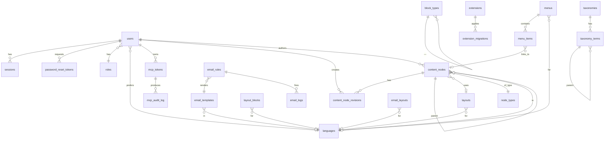

# Squilla Database Schema

Authoritative reference for the PostgreSQL schema, derived directly from the GORM models in `internal/models/`. The schema is managed by 43 embedded SQL migrations in `internal/db/migrations/` (`0001_initial_schema.sql` … `0043_languages_world_seed.sql`); GORM is **not** used for auto-migrate. To add or modify a table, write a new migration file — see `core_dev_guide.md` §3.4.

**Kernel/extensions boundary (commit `7e49268`):** Email and media tables that
predate the boundary refactor have moved out of the core migration set into
their owning extension's migration directory. Specifically:

- `email_templates`, `email_layouts`, `email_rules`, `email_logs`,
  `system_actions` are now owned by `extensions/email-manager/migrations/`.
- `media_files` columns and `media_image_sizes` are owned by
  `extensions/media-manager/migrations/`.

The migration files originally under `internal/db/migrations/` for those
tables (`0015_media_files.sql`, `0020_email_layouts.sql`,
`0034_media_files_asset_metadata.sql`, parts of `0009_roles_actions_email.sql`
and `0010_email_template_language.sql`) have been deleted. Existing installs
keep the tables (extension migrations are `IF NOT EXISTS`-guarded); fresh
installs get them on first activation of the owning extension. See
`docs/extension_api.md` §10 (Migration Ownership Transfer) for the pattern.

PostgreSQL 16+ is required. JSONB columns use GIN indexes where queried. Soft deletes use GORM's `gorm.DeletedAt`.

---

## Conventions

- All tables have `created_at` (and most have `updated_at`) populated by `autoCreateTime` / `autoUpdateTime` GORM tags. Times are `TIMESTAMPTZ`.
- Soft-delete tables (`content_nodes`) use `deleted_at TIMESTAMPTZ` indexed.
- Primary keys are `BIGSERIAL` for high-volume log tables, `SERIAL` otherwise. UUIDs (`gen_random_uuid()`) are used for sessions and revisions where ID predictability matters.
- Secret-bearing settings are encrypted at rest with AES-256-GCM (envelope format `enc:v1:<base64>`). The `is_encrypted` flag indicates current encryption status; the secret heuristic in `internal/secrets/` matches keys containing `_password`, `_key`, `_token`, `_apikey`, `_api_key`, `_credentials`, or `_secret`.

---

## Entity Relationships



---

## Auth & Identity

### `users`
Administrative accounts.

| Column | Type | Notes |
|---|---|---|
| `id` | SERIAL PK | |
| `email` | VARCHAR(255) UNIQUE NOT NULL | |
| `password_hash` | VARCHAR(255) NOT NULL | bcrypt; cost configurable via `BCRYPT_COST` env |
| `role_id` | INT NOT NULL | FK → `roles.id` |
| `language_id` | INT NULL | FK → `languages.id` |
| `full_name` | VARCHAR(100) NULL | |
| `last_login_at` | TIMESTAMPTZ NULL | |
| `created_at`, `updated_at` | TIMESTAMPTZ | |

### `roles`
RBAC role definitions. The `capabilities` JSONB stores boolean flags (`manage_users`, `manage_settings`, `default_node_access`) plus a per-node-type access map.

| Column | Type | Notes |
|---|---|---|
| `id` | SERIAL PK | |
| `slug` | VARCHAR(50) UNIQUE NOT NULL | `admin`, `editor`, `author`, `member` are seeded with `is_system=true` |
| `name` | VARCHAR(100) NOT NULL | |
| `description` | TEXT NULL | |
| `is_system` | BOOL DEFAULT false | Built-in roles cannot be deleted |
| `capabilities` | JSONB NOT NULL DEFAULT '{}' | See shape below |

Capability shape:
```json
{
  "admin_access": true,
  "manage_users": true,
  "manage_roles": true,
  "manage_settings": true,
  "manage_menus": true,
  "manage_layouts": true,
  "manage_email": true,
  "default_node_access": { "access": "write", "scope": "all" },
  "nodes": {
    "post": { "access": "read", "scope": "own" }
  },
  "email_subscriptions": ["user.registered", "node.published"]
}
```

### `sessions`
Active admin sessions. Cookie `squilla_session` carries the raw token; only the SHA-256 hash is stored.

| Column | Type | Notes |
|---|---|---|
| `id` | UUID PK DEFAULT gen_random_uuid() | |
| `user_id` | INT NOT NULL | FK → `users.id` |
| `token_hash` | VARCHAR(255) UNIQUE NOT NULL | |
| `ip_address` | VARCHAR(45) NULL | |
| `user_agent` | TEXT NULL | |
| `expires_at` | TIMESTAMPTZ NOT NULL | |
| `created_at` | TIMESTAMPTZ | Hourly cleanup loop deletes expired rows |

### `password_reset_tokens`
In-flight password reset requests. The raw token is sent once via email; only the SHA-256 hash is stored.

| Column | Type | Notes |
|---|---|---|
| `id` | SERIAL PK | |
| `user_id` | INT NOT NULL | FK → `users.id` |
| `token_hash` | VARCHAR(64) UNIQUE NOT NULL | |
| `expires_at` | TIMESTAMPTZ NOT NULL | |
| `used_at` | TIMESTAMPTZ NULL | Set on successful reset; row is preserved to detect replay |
| `ip_address` | VARCHAR(64) NULL | |
| `user_agent` | TEXT NULL | |
| `created_at` | TIMESTAMPTZ | Hourly cleanup loop deletes expired rows |

---

## Content

### `content_nodes`
The atomic unit of CMS content. Every page, post, product, etc. is a row here.

| Column | Type | Notes |
|---|---|---|
| `id` | SERIAL PK | |
| `uuid` | UUID UNIQUE NOT NULL DEFAULT gen_random_uuid() | |
| `parent_id` | INT NULL | FK → `content_nodes.id` (self-FK, recursive) |
| `node_type` | VARCHAR(50) NOT NULL DEFAULT 'page' | FK by slug → `node_types.slug` |
| `status` | VARCHAR(20) NOT NULL DEFAULT 'draft' | `draft`, `published`, `archived` |
| `language_code` | VARCHAR(10) NOT NULL DEFAULT 'en' | |
| `language_id` | INT NULL | FK → `languages.id` |
| `slug` | VARCHAR(255) NOT NULL | URL slug |
| `full_url` | TEXT NOT NULL | Computed cascading URL; partial unique index `WHERE deleted_at IS NULL` |
| `title` | VARCHAR(255) NOT NULL | |
| `featured_image` | JSONB NOT NULL DEFAULT '{}' | `{ "media_id", "url", "alt", ... }` |
| `excerpt` | TEXT NOT NULL DEFAULT '' | |
| `taxonomies` | JSONB NOT NULL DEFAULT '{}' | `{ "category": [12, 14], "tag": [...] }` |
| `blocks_data` | JSONB NOT NULL DEFAULT '[]' | Block tree; **GIN-indexed** |
| `seo_settings` | JSONB NOT NULL DEFAULT '{}' | `{ "title", "description", "og_image", "noindex" }` |
| `fields_data` | JSONB NOT NULL DEFAULT '{}' | Custom fields keyed by node type field schema |
| `layout_data` | JSONB NOT NULL DEFAULT '{}' | Layout-specific config |
| `author_id` | INT NULL | FK → `users.id` |
| `layout_id` | INT NULL | FK → `layouts.id` |
| `layout_slug` | VARCHAR NULL | Auto-synced from `layout_id` via `BeforeSave`; survives theme cycles |
| `translation_group_id` | UUID NULL | Sibling translations share this UUID |
| `version` | INT NOT NULL DEFAULT 1 | Incremented on update |
| `published_at` | TIMESTAMPTZ NULL | |
| `created_at`, `updated_at` | TIMESTAMPTZ | |
| `deleted_at` | TIMESTAMPTZ NULL | Soft delete (GORM `gorm.DeletedAt`) |

Indexes: GIN on `blocks_data`, partial unique on `full_url WHERE deleted_at IS NULL`, B-tree on `(status, language_code)`, `(parent_id)`, `(language_id)`, `(deleted_at)`.

### `content_node_revisions`
Point-in-time **full** snapshots created on every UpdateNode. Migration
`0041_node_revisions_full_snapshot.sql` widened the original blocks+SEO
snapshot to capture every editable field, so a restore can recreate title,
slug, status, language, layout, excerpt, featured image, custom fields, and
taxonomy assignments — not just the block tree. Pre-0041 rows keep their
existing two columns and the new ones default to empty/zero.

| Column | Type | Notes |
|---|---|---|
| `id` | BIGSERIAL PK | |
| `node_id` | INT NOT NULL | FK → `content_nodes.id` |
| `blocks_snapshot` | JSONB NOT NULL | |
| `seo_snapshot` | JSONB NOT NULL | |
| `title` | TEXT NOT NULL DEFAULT '' | Added 0041 |
| `slug` | TEXT NOT NULL DEFAULT '' | Added 0041 |
| `status` | VARCHAR(20) NOT NULL DEFAULT 'draft' | Added 0041 |
| `language_code` | VARCHAR(10) NOT NULL DEFAULT 'en' | Added 0041 |
| `layout_slug` | TEXT NULL | Added 0041 |
| `excerpt` | TEXT NOT NULL DEFAULT '' | Added 0041 |
| `featured_image` | JSONB NOT NULL DEFAULT '{}' | Added 0041 |
| `fields_snapshot` | JSONB NOT NULL DEFAULT '{}' | Added 0041 — custom fields_data |
| `taxonomies_snapshot` | JSONB NOT NULL DEFAULT '{}' | Added 0041 |
| `version_number` | INT NOT NULL DEFAULT 0 | Added 0041 — node `version` at snapshot time |
| `created_by` | INT NULL | FK → `users.id`; null for MCP/extension/system callers |
| `created_at` | TIMESTAMPTZ | Daily retention sweep keeps 50 most-recent revisions per node |

**Index:** `idx_node_revisions_node_created` on `(node_id, created_at DESC)`.

The admin "Revisions" sidebar tab and `core.node.revisions` /
`core.node.revision_restore` MCP tools both read this table.

### `node_types`
Custom content types beyond `page`/`post`.

| Column | Type | Notes |
|---|---|---|
| `id` | SERIAL PK | |
| `slug` | VARCHAR(50) UNIQUE NOT NULL | `page`, `post`, `recipe`, `product`, ... |
| `label` | VARCHAR(100) NOT NULL | |
| `label_plural` | VARCHAR(100) NOT NULL DEFAULT '' | |
| `icon` | VARCHAR(50) NOT NULL DEFAULT 'file-text' | Lucide icon name |
| `description` | TEXT NOT NULL DEFAULT '' | |
| `taxonomies` | JSONB NOT NULL DEFAULT '[]' | Allowed taxonomy slugs |
| `field_schema` | JSONB NOT NULL DEFAULT '[]' | Array of field definitions |
| `url_prefixes` | JSONB NOT NULL DEFAULT '{}' | `{ "en": "blog", "fr": "journal" }` |
| `supports_blocks` | BOOL NOT NULL DEFAULT true | False = node has only fields_data, no block tree |

### `taxonomies`
Taxonomy definitions (Category, Tag, Topic, etc.).

| Column | Type | Notes |
|---|---|---|
| `id` | SERIAL PK | |
| `slug` | VARCHAR(50) UNIQUE NOT NULL | |
| `label`, `label_plural` | VARCHAR(255) NOT NULL | |
| `description` | TEXT NOT NULL DEFAULT '' | |
| `hierarchical` | BOOL NOT NULL DEFAULT false | |
| `show_ui` | BOOL NOT NULL DEFAULT true | |
| `node_types` | TEXT[] NOT NULL DEFAULT '{}' | Which node types use this taxonomy |
| `field_schema` | JSONB NOT NULL DEFAULT '[]' | Custom term fields |

### `taxonomy_terms`
Individual terms within a taxonomy. Each language version of a term is its own row, linked via `translation_group_id` — same model as `content_nodes`.

| Column | Type | Notes |
|---|---|---|
| `id` | SERIAL PK | |
| `node_type` | VARCHAR(50) NOT NULL | |
| `taxonomy` | VARCHAR(50) NOT NULL | |
| `language_code` | VARCHAR(10) NOT NULL DEFAULT 'en' | Language this row's name/slug/description belong to. Backfilled to the site's default language by migration `0040_taxonomy_terms_i18n.sql`. |
| `translation_group_id` | UUID NULL | Shared across rows that are translations of each other. NULL until the first sibling translation is created (POST `/admin/api/terms/:id/translations`), at which point both source and clone get the same fresh UUID. |
| `slug`, `name` | VARCHAR(255) NOT NULL | |
| `description` | TEXT NOT NULL DEFAULT '' | |
| `parent_id` | INT NULL | FK → `taxonomy_terms.id` (hierarchical taxonomies only) |
| `count` | INT NOT NULL DEFAULT 0 | Denormalized usage count |
| `fields_data` | JSONB NOT NULL DEFAULT '{}' | |

**Uniqueness:** `(node_type, taxonomy, slug, language_code)` — slugs may recur across languages so EN "documentation" and PT "documentação" don't collide.

**Indexes:** `idx_taxonomy_terms_translation_group` on `translation_group_id` (partial, NULLs excluded), `idx_taxonomy_terms_language` on `(node_type, taxonomy, language_code)`.

### `redirects`
URL redirect rules (301/302).

| Column | Type | Notes |
|---|---|---|
| `id` | SERIAL PK | |
| `old_url` | TEXT UNIQUE NOT NULL | |
| `new_url` | TEXT NOT NULL | |
| `http_code` | INT NOT NULL DEFAULT 301 | 301 or 302 |

---

## Layouts, Blocks, Templates

### `block_types`
Reusable component definitions (hero, feature-grid, login-form).

| Column | Type | Notes |
|---|---|---|
| `id` | SERIAL PK | |
| `slug` | VARCHAR(50) UNIQUE NOT NULL | |
| `label` | VARCHAR(100) NOT NULL | |
| `icon` | VARCHAR(50) NOT NULL DEFAULT 'square' | |
| `description` | TEXT NOT NULL DEFAULT '' | |
| `field_schema` | JSONB NOT NULL DEFAULT '[]' | Field definitions for the block editor |
| `html_template` | TEXT NOT NULL DEFAULT '' | Go `html/template` source |
| `test_data` | JSONB NOT NULL DEFAULT '{}' | Sample data for the editor preview |
| `source` | VARCHAR(20) NOT NULL DEFAULT 'custom' | `custom`, `seed`, `theme`, `system` |
| `theme_name` | VARCHAR(100) NULL | Set when block ships with a theme |
| `view_file`, `block_css`, `block_js` | TEXT | |
| `content_hash` | VARCHAR(64) | For cache keying |
| `cache_output` | BOOL NOT NULL DEFAULT true | Skip re-render if `(slug, content_hash)` matches |

### `layouts`
Page-level templates (full HTML document).

| Column | Type | Notes |
|---|---|---|
| `id` | SERIAL PK | |
| `slug` | VARCHAR(255) NOT NULL | Resilient reference; survives theme cycles |
| `name` | VARCHAR(255) NOT NULL | |
| `description` | TEXT | |
| `language_id` | INT NULL | FK → `languages.id` |
| `template_code` | TEXT NOT NULL | Go template source |
| `source`, `theme_name` | (same shape as block_types) | |
| `is_default` | BOOL NOT NULL DEFAULT false | |
| `supports_blocks` | BOOL NOT NULL DEFAULT true | |
| `content_hash` | VARCHAR(64) | |

### `layout_blocks`
Reusable HTML chunks composable into layouts via `{{renderLayoutBlock "<slug>"}}`.

| Column | Type | Notes |
|---|---|---|
| `id` | SERIAL PK | |
| `slug`, `name` | VARCHAR(255) NOT NULL | |
| `description` | TEXT | |
| `language_id` | INT NULL | |
| `template_code` | TEXT NOT NULL | |
| `source`, `theme_name` | (same shape) | |
| `field_schema` | JSONB NOT NULL DEFAULT '[]' | |
| `content_hash` | VARCHAR(64) | |

Built-in seeded blocks: `primary-nav`, `user-menu`, `site-header`, `footer-nav`, `site-footer`.

### `templates`
Pre-configured block arrangements applied to nodes.

| Column | Type | Notes |
|---|---|---|
| `id` | SERIAL PK | |
| `slug` | VARCHAR(50) UNIQUE NOT NULL | |
| `label` | VARCHAR(100) NOT NULL | |
| `description` | TEXT NOT NULL DEFAULT '' | |
| `block_config` | JSONB NOT NULL DEFAULT '[]' | |
| `source`, `theme_name`, `content_hash` | | |

---

## Internationalization

### `languages`
Multi-language support.

| Column | Type | Notes |
|---|---|---|
| `id` | SERIAL PK | |
| `code` | VARCHAR(10) UNIQUE NOT NULL | `en`, `fr`, `de`, ... |
| `slug` | VARCHAR(20) UNIQUE NOT NULL | URL-safe variant of code |
| `name` | VARCHAR(100) NOT NULL | English name (`English`, `French`) |
| `native_name` | VARCHAR(100) NOT NULL DEFAULT '' | (`English`, `Français`) |
| `flag` | VARCHAR(10) NOT NULL DEFAULT '' | Emoji or icon identifier |
| `is_default` | BOOL NOT NULL DEFAULT false | Only one row should be true |
| `is_active` | BOOL NOT NULL DEFAULT true | |
| `hide_prefix` | BOOL NOT NULL DEFAULT false | Default + `hide_prefix=true` → `/about` instead of `/en/about` |
| `sort_order` | INT NOT NULL DEFAULT 0 | |

---

## Menus

### `menus`
Navigation menus, with optimistic locking via `version`.

| Column | Type | Notes |
|---|---|---|
| `id` | SERIAL PK | |
| `slug`, `name` | VARCHAR(255) NOT NULL | |
| `language_id` | INT NULL | |
| `version` | INT NOT NULL DEFAULT 1 | Incremented on item replacement |

### `menu_items`
Tree of menu entries, hierarchical via `parent_id`.

| Column | Type | Notes |
|---|---|---|
| `id` | SERIAL PK | |
| `menu_id` | INT NOT NULL | FK → `menus.id`; cascade-delete |
| `parent_id` | INT NULL | Self-FK; tree depth limit = 3 (depth 0/1/2) |
| `title` | VARCHAR(255) NOT NULL | |
| `item_type` | VARCHAR(20) NOT NULL DEFAULT 'custom' | `custom`, `node` |
| `node_id` | INT NULL | FK → `content_nodes.id` (item_type=`node`) |
| `url` | VARCHAR(2048) | Required when `item_type='custom'` |
| `target` | VARCHAR(20) NOT NULL DEFAULT '_self' | |
| `css_class` | VARCHAR(255) | |
| `sort_order` | INT NOT NULL DEFAULT 0 | |

---

## Media

### `media_files`
Uploaded assets. Owned by the `media-manager` extension since commit
`7e49268`. The kernel `MediaFile` model is gone; `core.media.*` calls now
route through whichever plugin declares `provides:["media-provider"]` —
`media-manager` is the bundled provider but operators can hot-swap an
S3/R2/Cloudinary extension. Schema lives in
`extensions/media-manager/migrations/`.

| Column | Type | Notes |
|---|---|---|
| `id` | uint PK | |
| `filename` | text NOT NULL | Stored UUID-based filename |
| `original_name` | text NOT NULL | Upload name |
| `mime_type` | text NOT NULL | |
| `size` | BIGINT NOT NULL | Bytes |
| `path` | text NOT NULL | Relative storage path |
| `url` | text NOT NULL | Full public URL |
| `width`, `height` | INT NULL | Nil for non-images |
| `alt` | text | Alt text |
| `slug` | text NULL UNIQUE | Portable reference (backfilled by migration 0031) |

Image sizes (`media_image_sizes`) and asset metadata are owned by the `media-manager` extension via its own migrations.

---

## Email

> **Owned by `email-manager` extension since commit `7e49268`.** The kernel
> no longer creates these tables — the extension does, via
> `extensions/email-manager/migrations/002_email_tables.sql`. Existing
> installs already have them; the extension migration is idempotent. The
> kernel `models/email_*.go` files were removed at the same time.

### `email_templates`
Reusable subject + body templates rendered with `html/template`.

| Column | Type | Notes |
|---|---|---|
| `id` | SERIAL PK | |
| `slug` | VARCHAR(100) NOT NULL | |
| `name` | VARCHAR(150) NOT NULL | |
| `language_id` | INT NULL | NULL = universal/fallback |
| `subject_template`, `body_template` | TEXT NOT NULL | |
| `test_data` | JSONB NOT NULL DEFAULT '{}' | |

### `email_layouts`
HTML wrapper applied to all outgoing emails (`{{.email_body}}` is injected).

| Column | Type | Notes |
|---|---|---|
| `id` | SERIAL PK | |
| `name` | VARCHAR(150) NOT NULL | |
| `language_id` | INT NULL | |
| `body_template` | TEXT NOT NULL | |
| `is_default` | BOOL NOT NULL DEFAULT false | |

### `email_rules`
Maps event actions to templates + recipient strategies.

| Column | Type | Notes |
|---|---|---|
| `id` | SERIAL PK | |
| `action` | VARCHAR(100) NOT NULL | E.g. `user.registered`, `node.published` |
| `node_type` | VARCHAR(50) NULL | Optional filter |
| `template_id` | INT NOT NULL | FK → `email_templates.id` |
| `recipient_type` | VARCHAR(20) NOT NULL | `actor`, `node_author`, `fixed`, `role` |
| `recipient_value` | VARCHAR(500) NOT NULL | Email address, role slug, etc. |
| `enabled` | BOOL NOT NULL DEFAULT true | |

### `email_logs`
Per-send audit trail. Daily retention sweep (commit `eb0c1eb`).

| Column | Type | Notes |
|---|---|---|
| `id` | SERIAL PK | |
| `rule_id` | INT NULL | FK → `email_rules.id` |
| `template_slug`, `action` | VARCHAR(100) NOT NULL | |
| `recipient_email` | VARCHAR(255) NOT NULL | |
| `subject` | TEXT NOT NULL | |
| `rendered_body` | TEXT NOT NULL | Full rendered HTML |
| `status` | VARCHAR(20) NOT NULL DEFAULT 'pending' | `pending`, `sent`, `failed` |
| `error_message` | TEXT NULL | |
| `provider` | VARCHAR(50) NULL | `smtp`, `resend`, ... |

### `system_actions`
Registry of named actions usable as email rule triggers.

| Column | Type | Notes |
|---|---|---|
| `id` | SERIAL PK | |
| `slug` | VARCHAR(100) UNIQUE NOT NULL | |
| `label` | VARCHAR(150) NOT NULL | |
| `category` | VARCHAR(50) NOT NULL | |
| `description` | TEXT | |
| `payload_schema` | JSONB NOT NULL DEFAULT '{}' | |

---

## Themes & Extensions

### `themes`
Installed theme registry. Migration `0022_single_active_theme` enforces only one active theme via partial unique index.

| Column | Type | Notes |
|---|---|---|
| `id` | SERIAL PK | |
| `slug` | VARCHAR(100) UNIQUE NOT NULL | |
| `name` | VARCHAR(200) NOT NULL | |
| `description` | TEXT NOT NULL DEFAULT '' | |
| `version` | VARCHAR(50) NOT NULL DEFAULT '' | |
| `author` | VARCHAR(200) NOT NULL DEFAULT '' | |
| `source` | VARCHAR(20) NOT NULL DEFAULT 'upload' | `upload`, `git`, `scan` |
| `git_url` | TEXT NULL | |
| `git_branch` | VARCHAR(100) NOT NULL DEFAULT 'main' | |
| `git_token` | TEXT NULL | Encrypted at rest (commit `f4ac40f`); never serialized to JSON |
| `is_active` | BOOL NOT NULL DEFAULT false | |
| `path` | VARCHAR(500) NOT NULL | Filesystem location |
| `thumbnail` | VARCHAR(500) NULL | |

### `extensions`
Installed extension registry.

| Column | Type | Notes |
|---|---|---|
| `id` | SERIAL PK | |
| `slug` | VARCHAR(100) UNIQUE NOT NULL | |
| `name` | VARCHAR(150) NOT NULL | |
| `version` | VARCHAR(50) NOT NULL DEFAULT '1.0.0' | |
| `description`, `author` | TEXT, VARCHAR(150) NOT NULL DEFAULT '' | |
| `path` | TEXT NOT NULL | |
| `is_active` | BOOL NOT NULL DEFAULT false | |
| `priority` | INT NOT NULL DEFAULT 50 | Boot order |
| `settings` | JSONB NOT NULL DEFAULT '{}' | |
| `manifest` | JSONB NOT NULL DEFAULT '{}' | Full `extension.json` cached for fast lookup |
| `installed_at` | TIMESTAMPTZ | |

### `extension_migrations`
Per-extension migration ledger (analogous to core's `schema_migrations`).

| Column | Type | Notes |
|---|---|---|
| `extension_slug` | VARCHAR(100) NOT NULL | |
| `filename` | TEXT NOT NULL | |
| `applied_at` | TIMESTAMPTZ | |
| | | UNIQUE on `(extension_slug, filename)` |

### `schema_migrations`
Core migration ledger.

| Column | Type | Notes |
|---|---|---|
| `filename` | TEXT PK | |
| `applied_at` | TIMESTAMPTZ | |

---

## Configuration

### `site_settings`
Key-value site configuration with per-language storage. Sensitive values (matched by the `internal/secrets/` heuristic) are stored in the AES-256-GCM envelope format `enc:v1:<base64>`.

| Column | Type | Notes |
|---|---|---|
| `key` | VARCHAR(100) | |
| `language_code` | VARCHAR(8) NOT NULL DEFAULT '' | Language this row applies to. See "Per-language storage" below. |
| `value` | TEXT NULL | Plaintext or `enc:v1:...` |
| `is_encrypted` | BOOL DEFAULT false | |
| `updated_at` | TIMESTAMPTZ | |

**Primary key:** composite `(key, language_code)`. Same key may have one row per language plus one default-language fallback row.

**Per-language storage** (introduced in migrations `0038_site_settings_language_code.sql` and `0039_site_settings_default_locale.sql`):

- Every row carries the language code it applies to (e.g. `'en'`, `'vi'`, `'pt'`).
- Reads scope to the caller's language (X-Admin-Language header for admin, current request locale for public render) and **fall back to the default-language row** when no per-locale row exists.
- Writes target the caller's locale; an empty `""` is resolved to the default language at write time.
- The legacy `''` "shared sentinel" is gone — migration 0039 backfills any leftover `''` rows to the default-language code, deduping against existing per-locale rows on the way (per-locale row wins).

`GET /admin/api/settings` accepts `X-Admin-Language` and returns each key's value resolved for that locale (with default-language fallback). `PUT /admin/api/settings` writes at the caller's admin language. Both theme settings and site settings use this same mechanism — there is no separate "translatable flag" anymore; every setting is implicitly per-locale.

Reads via `GET /admin/api/settings` redact secret-shaped keys (commit `54f573a`).

---

## MCP (AI Interface)

### `mcp_tokens`
Bearer tokens for AI clients calling `/mcp`. Raw token is shown once; only the SHA-256 hash is stored.

| Column | Type | Notes |
|---|---|---|
| `id` | SERIAL PK | |
| `user_id` | INT NOT NULL | FK → `users.id` (token issuer) |
| `name` | VARCHAR(100) NOT NULL | Human label |
| `token_hash` | VARCHAR(64) UNIQUE NOT NULL | |
| `token_prefix` | VARCHAR(16) NOT NULL | First few chars (for log identification) |
| `scope` | VARCHAR(16) NOT NULL DEFAULT 'full' | `read`, `content`, `full` |
| `capabilities` | JSONB NOT NULL DEFAULT '{}' | Reserved for future per-tool grants |
| `last_used_at` | TIMESTAMPTZ NULL | |
| `expires_at` | TIMESTAMPTZ NULL | |

### `mcp_audit_log`
Per-tool-call audit trail. Daily retention sweep (commit `eb0c1eb`).

| Column | Type | Notes |
|---|---|---|
| `id` | BIGSERIAL PK | |
| `token_id` | INT NULL | FK → `mcp_tokens.id` |
| `tool` | VARCHAR(100) NOT NULL | E.g. `core.node.create` |
| `args_hash` | VARCHAR(64) | SHA-256 of marshalled args (no PII) |
| `status` | VARCHAR(16) NOT NULL | `ok`, `error`, `denied`, `rate_limited` |
| `error_code` | VARCHAR(64) | |
| `duration_ms` | INT NOT NULL DEFAULT 0 | |

Indexes: `(token_id, created_at DESC)`, `(tool, created_at DESC)`.

### `pending_uploads`
Single-row state machine for the three-step presigned-upload flow used by
`core.<kind>.upload_init` → `PUT /api/uploads/<token>` →
`core.<kind>.upload_finalize`. The token IS the auth for the PUT route, so
high entropy + a short TTL + atomic state transitions are the entire
security story. Added by migration `0042_pending_uploads.sql`. See
`docs/extension_api.md` §9 (Presigned uploads) for the client contract.

| Column | Type | Notes |
|---|---|---|
| `token` | VARCHAR(64) PK | Unguessable, single-use |
| `kind` | VARCHAR(16) NOT NULL | `media`, `theme`, `extension` |
| `user_id` | BIGINT NOT NULL | Issuer; the row is bound to them |
| `filename` | TEXT NOT NULL DEFAULT '' | Optional hint from `_init` |
| `mime_type` | TEXT NOT NULL DEFAULT '' | Optional hint from `_init` |
| `max_bytes` | BIGINT NOT NULL | Per-kind cap (env-tunable: `SQUILLA_MEDIA_MAX_MB`, `SQUILLA_THEME_MAX_MB`, `SQUILLA_EXTENSION_MAX_MB`) |
| `state` | VARCHAR(16) NOT NULL DEFAULT 'pending' | `pending` → `uploaded` → `finalized` |
| `size_bytes` | BIGINT NULL | Set by PUT |
| `sha256` | CHAR(64) NULL | Set by PUT, may be re-checked at finalize |
| `temp_path` | TEXT NULL | `data/pending/<token>.bin` |
| `created_at`, `expires_at`, `finalized_at` | TIMESTAMPTZ | ~15 min TTL |

Index: `idx_pending_uploads_state_expires` on `(state, expires_at)`. A
background ticker every 5 minutes deletes expired-not-finalized rows along
with their temp files (`internal/uploads/cleanup.go`).

---

## Migration Catalog

| Filename | Adds |
|---|---|
| `0001_initial_schema.sql` | users, sessions, content_nodes |
| `0002_partial_unique_full_url.sql` | partial unique index on `full_url WHERE deleted_at IS NULL` |
| `0003_node_types.sql` | node_types |
| `0004_languages.sql` | languages, language fields on nodes |
| `0005_blocks_templates.sql` | block_types, templates |
| `0006_block_html_templates.sql` | `block_types.html_template` |
| `0007_block_test_data.sql` | `block_types.test_data` |
| `0008_layouts_menus.sql` | layouts, layout_blocks, menus, menu_items |
| `0009_roles_actions_email.sql` | roles, system_actions (email tables now owned by email-manager extension) |
| `0010_email_template_language.sql` | language fallback for email templates (email tables now owned by email-manager extension) |
| `0011_themes.sql` | themes |
| `0012_extensions.sql` | extensions |
| `0012_template_source.sql` | `templates.source`, `theme_name` |
| `0013_default_lang_hide_prefix.sql` | `languages.hide_prefix` |
| `0014_extension_manifest.sql` | `extensions.manifest` JSONB |
| `0015_media_files.sql` | *(deleted in commit `7e49268`)* — media_files now owned by media-manager extension migrations |
| `0016_add_manage_content_capability.sql` | seed admin role with `manage_content` |
| `0017_extension_migrations.sql` | extension_migrations |
| `0018_activate_builtin_extensions.sql` | activate media-manager + email-manager + sitemap-generator + smtp-provider + resend-provider |
| `0019_block_type_cache_output.sql` | `block_types.cache_output` |
| `0020_email_layouts.sql` | *(deleted in commit `7e49268`)* — email_layouts now owned by email-manager extension migrations |
| `0021_block_type_content_hash.sql` | `block_types.content_hash` |
| `0022_single_active_theme.sql` | partial unique on `themes.is_active` |
| `0023_node_standard_fields.sql` | featured_image, excerpt, taxonomies on content_nodes |
| `0024_taxonomies_table.sql` | taxonomies |
| `0025_taxonomy_terms_table.sql` | taxonomy_terms |
| `0026_advanced_taxonomies.sql` | hierarchical, show_ui, node_types[], field_schema |
| `0027_layout_partial_fields.sql` | `layout_blocks.field_schema` |
| `0028_mcp.sql` | mcp_tokens, mcp_audit_log |
| `0029_node_type_label_plural.sql` | `node_types.label_plural` |
| `0030_taxonomy_label_plural.sql` | `taxonomies.label_plural` |
| `0031_slug_refs.sql` | `media_files.slug`, `content_nodes.layout_slug` |
| `0032_supports_blocks.sql` | `node_types.supports_blocks`, `layouts.supports_blocks` |
| `0033_activate_forms_extension.sql` | activate forms |
| `0034_media_files_asset_metadata.sql` | *(deleted in commit `7e49268`)* — media-manager extension owns this now |
| `0035_builtin_node_type_labels.sql` | seed labels |
| `0036_default_layout_seed_source.sql` | mark default layout source |
| `0037_password_reset_tokens.sql` | password_reset_tokens |
| `0038_site_settings_language_code.sql` | per-language storage on `site_settings` (composite PK `(key, language_code)`) |
| `0039_site_settings_default_locale.sql` | drop the `''` "shared sentinel" — backfill leftover rows to the default-language code |
| `0040_taxonomy_terms_i18n.sql` | per-language storage on `taxonomy_terms` (`language_code`, `translation_group_id`, slug uniqueness scoped per language) |
| `0041_node_revisions_full_snapshot.sql` | widen `content_node_revisions` to capture title, slug, status, language, layout, excerpt, featured_image, fields, taxonomies, version |
| `0042_pending_uploads.sql` | `pending_uploads` table powering the presigned `core.<kind>.upload_{init,finalize}` flow |
| `0043_languages_world_seed.sql` | seed ~60 world languages (only English active by default; existing rows untouched) |

Migrations are idempotent (`IF NOT EXISTS`, `IF EXISTS`, `ON CONFLICT DO NOTHING`) and run in numeric order. There is no rollback infrastructure — every migration must be designed so a failed deploy can be hand-rolled back.

---

## Extension-Owned Tables

Extensions ship their own SQL migrations and own their own tables. The kernel does **not** know these schemas.

| Extension | Tables |
|---|---|
| `forms` | forms, form_submissions, form_webhook_logs |
| `email-manager` | email_templates, email_layouts, email_rules, email_logs (migrated out of core in commit `7e49268`) |
| `media-manager` | media_files, media_image_sizes, media optimization queue (migrated out of core in commit `7e49268`) |
| `seo-extension` | (uses kernel `site_settings` only — no extension tables) |
| `sitemap-generator` | sitemap snapshots |

Extensions access only their declared `data_owned_tables` (manifest), enforced by the per-table ACL (commit `654dae5`). The migration ownership transfer pattern used to move email/media tables out of core is documented in `docs/extension_api.md` §10.
